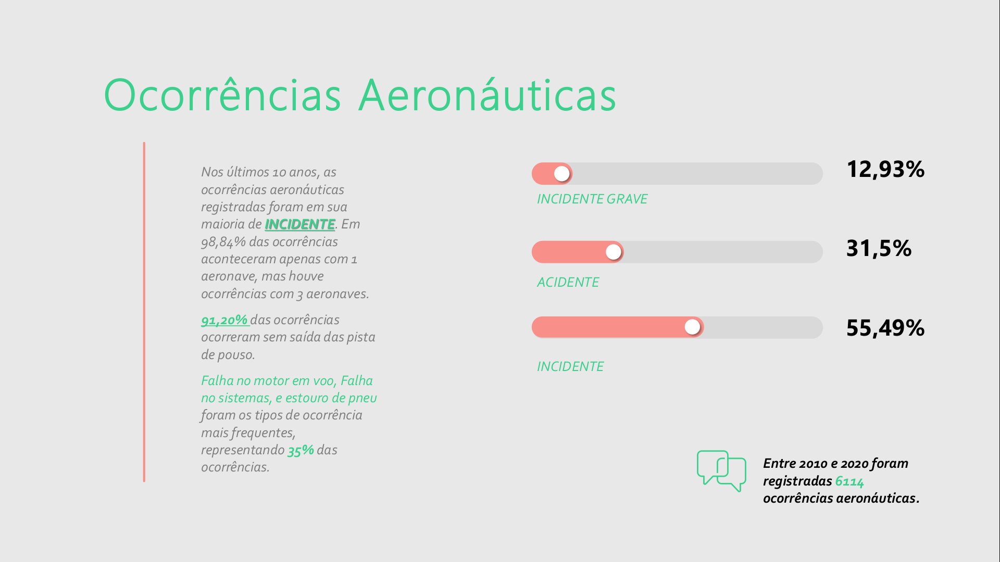
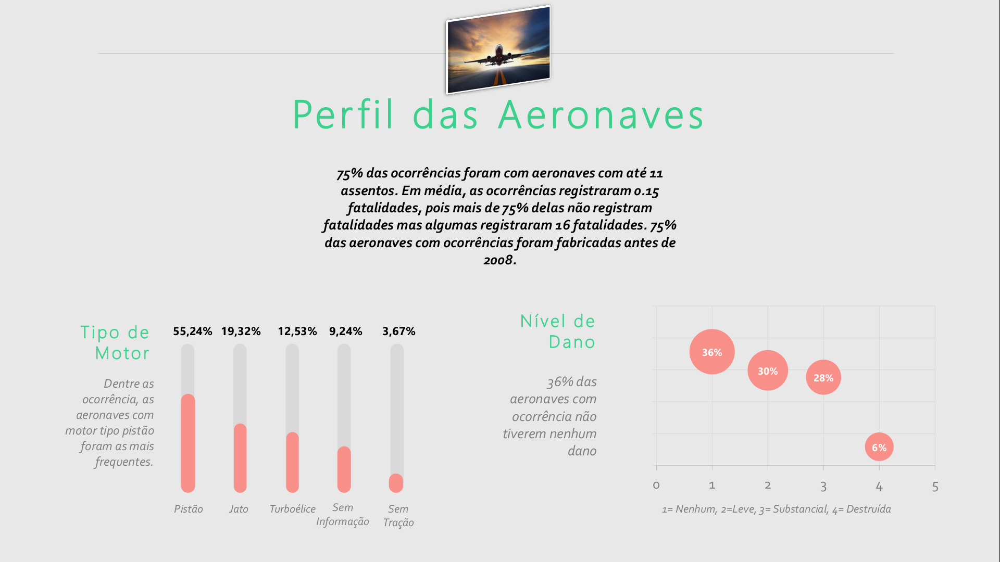

# Ocorrências Aeronáuticas na Aviação Civil Brasileira

-   [1. Descrição](#1-descrição)
    -   [1.1. Modelo de Poisson](#11-modelo-de-poisson)
-   [2. Organização do Diretório](#2-organização-do-diretório)
-   [3. Apresentação dos Resultados](#3-apresentação-dos-resultados)
-   [4. Referências](#4-referências)

# 1. Descrição

Análise da base dados “Ocorrências Aeronáuticas na Aviação Civil Brasileira”, utilizando dados abertos do governo, disponíveis em: (https://dados.gov.br/dataset/ocorrencias-aeronauticas-da-aviacao-civil-brasileira) ou [aqui](https://github.com/Leiliane-Oliveira/Ocorrencias_Aeronauticas_na_Aviacao_Civil_Brasileira/tree/main/Dados) neste repositório.

O objetivo desta análise é explorar as bases de dados para responder questões como:

-   :pushpin: Das informações catalogadas em cada base de dados (as variáveis), quais podem ser de interesse para explicar o número de fatalidades em um acidente aéreo?  
-   :pushpin: Qual fase de operação de um vôo é mais perigosa (gera mais acidentes/incidentes)?  
-   :pushpin: Existe relação entre as variáveis de interesse?  
-   :pushpin: Das variáveis de interesse quais podem explicar o número de fatalidades em um acidente aéreo? E como? 

Usou-se o **[modelo de Poisson](https://pt.wikipedia.org/wiki/Distribui%C3%A7%C3%A3o_de_Poisson)** para explicar os fatores que impactam na taxa de fatalidade das ocorrências de aeronaves brasileiras nos últimos 10 anos. Toda a análise descritiva das bases de dadas estão comentadas no script R.Utilizou-se as bibliotecas do **software R**:

> -   ['tidverse'](https://www.tidyverse.org/packages/) que não é uma biblioteca única, mas um conjunto de pacotes inter-relacionados que seguem os princípios do "tidy data". Inclui pacotes como **'dplyr'** para manipulação de dados, **'ggplot2'** para visualizações, **'tidyr'** para arrumar os dados, **'readr'** usada para mportar dados de diferentes formatos, como CSV, TSV e arquivos delimitados entre outros. Esses pacotes visam fornecer uma abordagem consistente e eficiente para análise e visualização de dados.

> -   ['gtsummary'](https://cran.r-project.org/web/packages/gtsummary/index.html) é usada para criar resumos de tabelas e relatórios estatísticos a partir de objetos **data.frame** ou **tbl** (do **'dplyr'**). Ela fornece uma maneira simples de criar tabelas bonitas e informativas, muitas vezes usadas para resumir estatísticas descritivas e resultados de modelos.

> -   ['RColorBrewer'](https://cran.r-project.org/web/packages/RColorBrewer/index.html)' que oferece um conjunto de paletas de cores pré-definidas, que são úteis para criar gráficos atraentes e legíveis. As paletas são especialmente projetadas para melhorar a distinção entre diferentes categorias de dados em gráficos.

> -   ['naniar'](https://cran.r-project.org/web/packages/naniar/index.html) é utilizada para lidar com dados ausentes (missing data). Ela oferece funções para visualizar padrões de valores ausentes, imputar valores faltantes, calcular estatísticas relacionadas a dados ausentes e mais.

> -   ['AER'](https://cran.r-project.org/web/packages/AER/index.html) é um pacote voltado para análise econométrica aplicada em R. Ele fornece funções e conjuntos de dados para a aplicação de métodos econômicos, como modelos de regressão, séries temporais e análises de dados transversais.

## 1.1. Modelo de Poisson

O Modelo de Poisson é uma ferramenta estatística utilizada para modelar a ocorrência de eventos raros em um intervalo de tempo ou espaço. Ele é aplicado quando estamos interessados em contar quantas vezes um evento específico acontece dentro de uma unidade de observação (como um período de tempo, uma área geográfica, etc.), e esses eventos são considerados raros o suficiente para que a probabilidade de mais de um evento ocorrer no mesmo intervalo seja baixa.

Principais características do Modelo de Poisson:

-   Contagem de Eventos: O modelo é usado para contar o número de eventos que ocorrem dentro de um intervalo específico, como o número de acidentes de trânsito em um cruzamento em um dia.

-   Independência: Ocorrências de eventos devem ser independentes umas das outras. Isso significa que a ocorrência de um evento não afeta a probabilidade de ocorrência de outro evento.

-   Raridade: Os eventos devem ser raros o suficiente para que a probabilidade de mais de um evento ocorrer no mesmo intervalo seja praticamente nula.

-   Taxa Constante: A taxa de ocorrência de eventos deve ser aproximadamente constante no intervalo de observação.

A distribuição de probabilidade subjacente no Modelo de Poisson é chamada de Distribuição de Poisson. Ela descreve a probabilidade de ocorrer exatamente um certo número de eventos em um determinado intervalo, dado a taxa média de ocorrência de eventos nesse intervalo. A fórmula da distribuição de Poisson é:

 
  P(X = x) = (e^(-λ) * λ^x) / x!

Onde:

-   \( P(X=x) \) é a probabilidade de ocorrerem \( x \) eventos.
-   \( e \) é a base do logaritmo natural (aproximadamente 2.71828).
-   \( λ) é a taxa média de ocorrência de eventos no intervalo.
-   \( x \) é o número de eventos que estamos contando.

O Modelo de Poisson é amplamente utilizado em diversas áreas, como epidemiologia, segurança, finanças e engenharia, sempre que estamos lidando com a contagem de eventos raros. Ele oferece uma abordagem simples e eficaz para lidar com situações em que a distribuição de eventos é relativamente imprevisível, mas ainda podemos estimar probabilidades e tomar decisões informadas.

> Nos resultados da análise veremos que a taxa de fatalidade em incidentes aeronáuticos é um evento raro. Em média, as ocorrências registraram 0.15 fatalidades. 75% das ocorrências não registraram nenhuma fatalidade. Por isso usamos o modelo de Poisson para identificar o que afeta a taxa de fatalidade.

# 2. Organização do Diretório

Neste diretório os arquivos estão organizados da seguinte forma:

:file_folder: [Dados](https://github.com/Leiliane-Oliveira/Ocorrencias_Aeronauticas_na_Aviacao_Civil_Brasileira/tree/main/Dados) : Pasta com os dados em csv

:file_folder: [Graficos](https://github.com/Leiliane-Oliveira/Ocorrencias_Aeronauticas_na_Aviacao_Civil_Brasileira/tree/main/Graficos) : Pasta com todos os gráficos gerados na análise

:file_folder: [Slides](https://github.com/Leiliane-Oliveira/Ocorrencias_Aeronauticas_na_Aviacao_Civil_Brasileira/tree/main/Slides) : Pasta com os slides da Apresentação dos Resultados

:page_facing_up: [SCRIPT](https://github.com/Leiliane-Oliveira/Ocorrencias_Aeronauticas_na_Aviacao_Civil_Brasileira/blob/main/SCRIPT.R): Script da análise em R

# 3. Apresentação dos Resultados

  
  
  
  
  
  
  

 
 

# 4. Referências

**CORDEIRO**, G. M., & **DEMÉTRIO**, C. G. <i>Modelos lineares generalizados e extensões</i>. Sao Paulo. (2008)

**GILBERTO**, A. P. <i> MODELOS DE REGRESSÃO com apoio computacional</i>. Instituto de Matemática e Estatística Universidade de São Paulo.

**DOBSON**, A. J. <i>An Introdutcion to Generalized Linear Model</i>, 2.ed.
Whashington: Chapman & hall/CRC, 2002.
